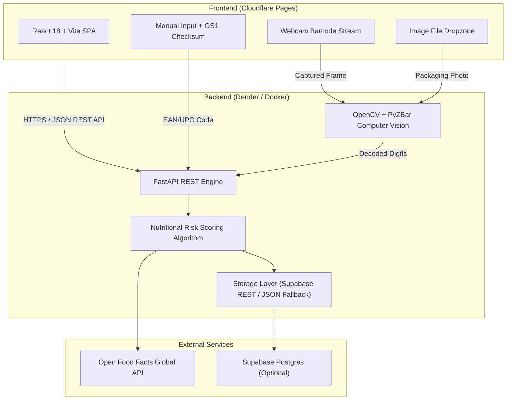

# NutriScan PRO — Food Health & Nutritional Risk Analyzer

[](https://fastapi.tiangolo.com)
[-61DAFB?style=flat&logo=react&logoColor=black)](https://reactjs.org/)
[](https://www.docker.com/)
[](https://opensource.org/licenses/MIT)

A modern, production-grade web application that analyzes packaged food products by barcode. Users can scan barcodes using their device camera, drag-and-drop packaging photos, or enter barcodes manually with real-time GS1 check-digit verification. The application calculates an evidence-based **Health Score (0–100)**, **NutriScore rating**, **NOVA processing classification (1–4)**, allergen warnings, additive breakdowns, and nutrient charts, leveraging the **Open Food Facts API** with community caching.

---

## Architecture Overview

The system is designed with a decoupled client-server architecture:



---

## Key Features

- **Multi-Modal Barcode Input**:
  - **Live Camera Scanner**: Browser camera stream with rear/environment camera support and aiming reticle.
  - **Packaging Photo Upload**: Drag-and-drop image dropzone with multi-pass OpenCV preprocessing (contrast boost, scaling, equalization) and `pyzbar` barcode decoding.
  - **Manual Barcode Search**: Instant GS1 check-digit verification to catch misread or mistyped digits before querying the database.
  - **Sample Barcode Quick-Pills**: Instant evaluation of benchmark products (Nutella, Coca-Cola, Barilla Pasta).
- **Nutritional & Health Analysis**:
  - **Algorithmic Health Score (0–100)**: Evaluates high sugar, saturated fat, sodium, fiber, protein, and ultra-processing level.
  - **NutriScore Badge**: Displays standard European NutriScore (A through E).
  - **NOVA Ultra-Processed Classification**: Grades foods from Group 1 (Unprocessed) to Group 4 (Ultra-processed).
  - **Macronutrient Breakdown**: SVG/CSS nutrient graph displaying Sugar, Fat, Protein, Fiber, and Salt per 100g.
  - **Allergens & Traces**: Instant alerts for declared allergens (Milk, Gluten, Nuts, Soy, etc.) and trace cross-contaminations.
  - **Additive Registry**: Lists identified food additives with codes and designations.
- **Community Product Contribution**:
  - For unindexed products, provides a frictionless contribution flow to add Product Name, Brand, Sugar, Fat, and Salt into the persistent cache.
- **Production-Ready DevOps**:
  - Docker containerization respecting Render's dynamic `$PORT`.
  - Configurable CORS middleware.
  - Zero-credential local development with optional Supabase cloud sync.

---

## Tech Stack

| Layer | Technology |
|---|---|
| **Frontend** | React 18, Vite 6, Modern CSS Design System, Lucide React |
| **Backend** | FastAPI, Uvicorn, Pydantic v2, Python 3.11 |
| **Computer Vision** | OpenCV (`opencv-python-headless`), `pyzbar`, Pillow |
| **Data & APIs** | Open Food Facts REST API, Supabase REST API (optional) |
| **DevOps & Containers** | Docker, Docker Compose, Cloudflare Pages, Render |

---

## Project Structure

```text
foodhealthAnalyser-updated/
├── backend/
│   ├── api/
│   │   └── routes.py           # REST routes (/health, /api/analyze, /api/scan, /api/contribute, /api/stats)
│   ├── core/
│   │   └── config.py           # Application settings, CORS origins, Supabase configuration
│   ├── schemas/
│   │   └── models.py           # Pydantic request & response schemas
│   ├── engine.py               # Pure business logic: OFF lookup, health scoring, ingredient parsing
│   ├── barcode_utils.py        # Barcode normalization, GS1 checksum validation, OpenCV preprocessing
│   ├── storage.py              # Supabase REST client with local JSON fallback
│   ├── main.py                 # FastAPI application factory with CORS middleware and error handlers
│   ├── test_backend.py         # Automated integration test suite
│   └── requirements.txt        # Production backend dependencies
├── frontend/
│   ├── public/                 # Static assets and favicon
│   ├── src/
│   │   ├── components/
│   │   │   ├── Header.jsx          # Branding and live backend status indicator
│   │   │   ├── StatsBar.jsx        # Total scans counter and accuracy benchmarks
│   │   │   ├── ManualSearch.jsx    # Barcode input with GS1 checksum indicator
│   │   │   ├── BarcodeScanner.jsx  # Live camera viewfinder and capture
│   │   │   ├── ImageUpload.jsx     # Packaging photo dropzone
│   │   │   ├── NutritionChart.jsx  # Responsive nutrient bar graph
│   │   │   ├── ReportView.jsx      # Comprehensive health analysis view
│   │   │   └── ContributeModal.jsx # Community product contribution modal
│   │   ├── config/
│   │   │   └── api.js              # Centralized API configuration (VITE_API_URL)
│   │   ├── services/
│   │   │   └── api.js              # API communication layer
│   │   ├── styles/
│   │   │   └── index.css           # Premium dark-slate design system
│   │   ├── App.jsx                 # Main application dashboard
│   │   └── main.jsx
│   ├── index.html
│   ├── package.json
│   ├── vite.config.js
│   └── .env.example
├── Dockerfile                  # Production container for Render deployment
├── .dockerignore               # Container build context exclusions
├── .gitignore                  # Git exclusions
├── .env.example                # Safe environment variable template
└── README.md                   # Project documentation
```

---

## Local Development Setup

### Prerequisites
- Python 3.11+
- Node.js 18+ and npm

### 1. Backend Setup

```bash
# Navigate to workspace
cd backend

# Create and activate virtual environment
python -m venv venv

# Windows:
venv\Scripts\activate
# macOS/Linux:
source venv/bin/activate

# Install dependencies
pip install -r requirements.txt

# Run automated tests to verify setup
python test_backend.py

# Start the development server
uvicorn main:app --reload --port 8000
```

The backend is now live at `http://localhost:8000`.
- Interactive Swagger documentation: `http://localhost:8000/docs`
- Health check: `http://localhost:8000/health`

### 2. Frontend Setup

```bash
# In a new terminal, navigate to frontend
cd frontend

# Install dependencies
npm install

# Start Vite dev server
npm run dev
```

The frontend application will be running at `http://localhost:5173`.

---

## Environment Variables

Copy `.env.example` to create your local `.env`:

### Backend Variables

| Variable | Required | Default | Description |
|---|---|---|---|
| `PORT` | No | `8000` | Port for the ASGI server (set dynamically by Render). |
| `CORS_ORIGINS` | No | `http://localhost:5173,...` | Comma-separated list of allowed frontend domains. |
| `SUPABASE_URL` | No | *(empty)* | Supabase project URL for persistent cloud caching. |
| `SUPABASE_KEY` | No | *(empty)* | Supabase anon/public key. |

### Frontend Variables

| Variable | Required | Default | Description |
|---|---|---|---|
| `VITE_API_URL` | No | `http://localhost:8000` | Base URL of the FastAPI backend. Set to your Render URL in production. |

---

## Docker Deployment (Render)

The backend includes a production-ready, lightweight Dockerfile based on `python:3.11-slim` with system `libzbar0` installed for image decoding.

### Build and Run Locally with Docker:

```bash
# Build the container image
docker build -t food-health-analyzer-api .

# Run the container
docker run -p 8000:8000 -e PORT=8000 food-health-analyzer-api
```

### Deploying Backend to Render (Free Tier):
1. Push this repository to GitHub.
2. Log into [Render](https://render.com) and click **New +** -> **Web Service**.
3. Connect your GitHub repository.
4. Select **Docker** as the runtime environment.
5. In **Environment Variables**, configure:
   - `CORS_ORIGINS`: `https://<YOUR-CLOUDFLARE-PAGES-DOMAIN>.pages.dev`
   - `SUPABASE_URL` & `SUPABASE_KEY` *(Optional)*
6. Click **Deploy Web Service**. Render will build the Docker container and provide your live API URL (e.g. `https://food-health-api.onrender.com`).

---

## Frontend Deployment (Cloudflare Pages)

The React frontend is optimized for static hosting on Cloudflare Pages.

### Deploying Frontend:
1. Log into [Cloudflare Dashboard](https://dash.cloudflare.com) and navigate to **Workers & Pages**.
2. Click **Create Application** -> **Pages** -> **Connect to Git**.
3. Select your repository and configure build settings:
   - **Framework preset**: `Vite`
   - **Root directory**: `frontend`
   - **Build command**: `npm run build`
   - **Build output directory**: `dist`
4. In **Environment Variables**, add:
   - `VITE_API_URL`: `https://<YOUR-RENDER-BACKEND>.onrender.com`
5. Click **Save and Deploy**. Cloudflare Pages will build and deploy your site globally on edge CDN.

---

## API Documentation

### `GET /health`
Returns service status, model readiness, and storage mode.
```json
{
  "status": "healthy",
  "model_loaded": true,
  "storage_mode": "local",
  "version": "1.0.0"
}
```

### `GET /api/stats`
Returns total products scanned and accuracy benchmarks.
```json
{
  "scan_count": 28,
  "ingredient_risk_accuracy": {
    "value": 0.94,
    "n": 150,
    "date": "2026-09-05"
  },
  "storage_mode": "local"
}
```

### `GET /api/analyze/{barcode}`
Retrieves product data, scores nutritional risk, and increments analytics.
```json
{
  "success": true,
  "not_found": false,
  "name": "Nutella",
  "brand": "Ferrero",
  "score": 35,
  "recommendation": "❌ Avoid Frequent Consumption",
  "reasons": [
    "High sugar content",
    "High fat",
    "High saturated fat",
    "Ultra-processed food (NOVA 4)"
  ],
  "nutriscore": "E",
  "nova_group": 4,
  "nova_label": "Ultra-processed food",
  "allergens": ["Milk", "Nuts", "Soybeans"],
  "nutrients": {
    "Sugar": 56.3,
    "Fat": 30.9,
    "Protein": 6.3,
    "Salt": 0.1
  },
  "source": "Open Food Facts",
  "barcode": "3017620422003"
}
```

### `POST /api/scan/image`
Uploads a photo containing a barcode (`multipart/form-data`) and extracts barcode digits.

### `POST /api/contribute`
Saves an unknown product to the community cache and immediately returns an evaluated report.

---

## Legacy Reference

The original Streamlit application files are preserved in the repository in `foodhealthAnalyser-main/` for backward reference and comparison.

---

## License

This project is licensed under the MIT License.
